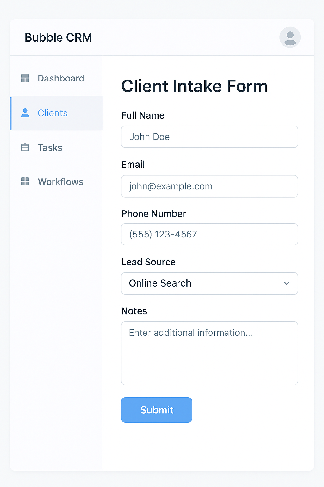
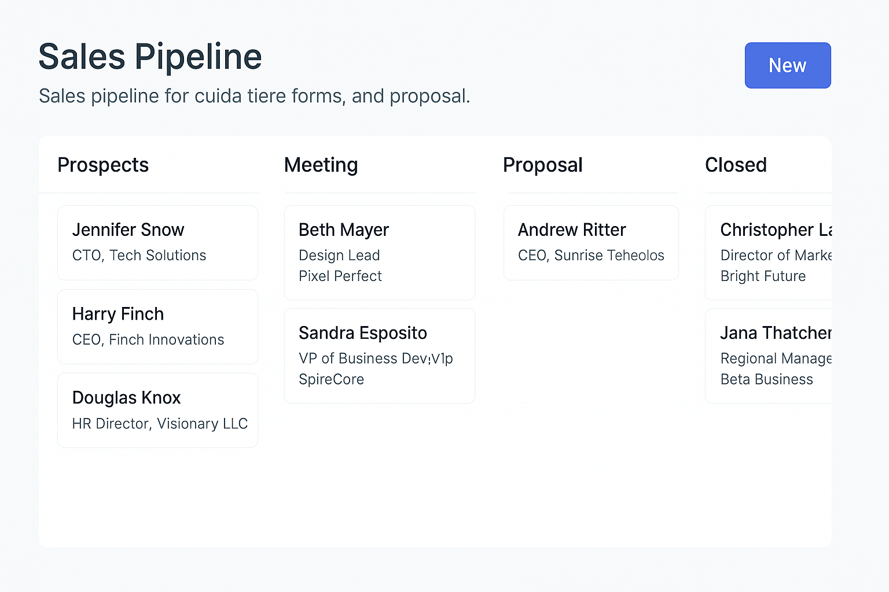
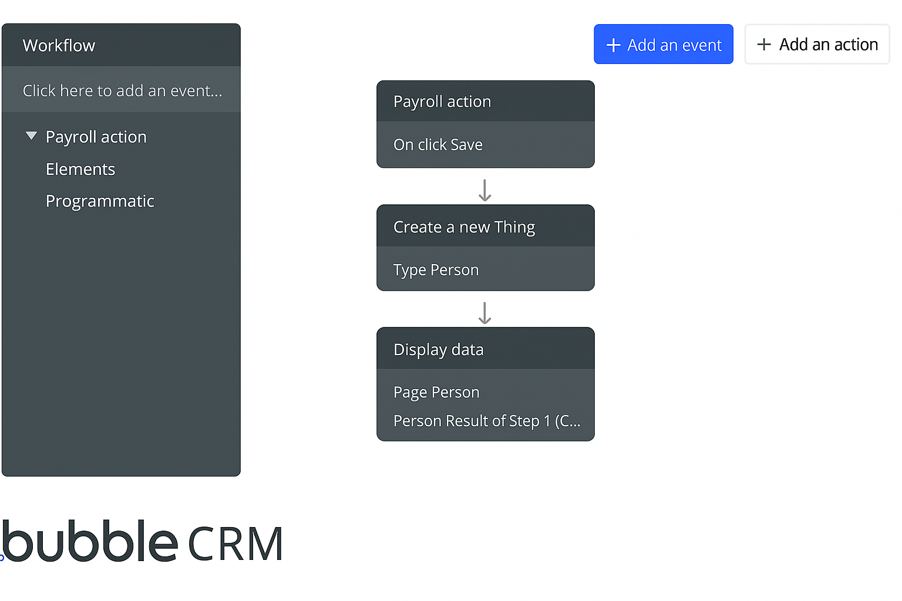

# 🔶 Custom CRM – Bubble.io Case Study

📌 **Platform:** [Bubble.io](https://bubble.io)  
🎯 **Purpose:** Build a no-code CRM with visual workflows, filtered tables, and custom form actions.  
👨‍💼 **Role:** Workflow Architect + UI Logic + Client Training  
📆 **Date:** March 2024

---

## 🔍 Project Overview

This CRM system was designed for a mid-sized agency that needed:
- Client intake forms
- Filterable lead pipelines
- Internal workflow approvals
- Automated task reminders
- Admin role control + email alerts

Built entirely in **Bubble.io**, the app enabled rapid MVP delivery and full customization without traditional code.

---

## ✅ Key Features

- 📝 **Dynamic Forms** – Custom forms for client data capture  
- 🧠 **Conditional Workflows** – Auto-triggered email alerts and status changes  
- 🔍 **Filtered Pipelines** – View clients by status, rep, or lead source  
- 📅 **Calendar View** – Assigned task deadlines by agent  
- 🔐 **Role-Based Visibility** – Admins, team leads, and limited agents  
- 🔁 **Third-Party Integrations** – Gmail, Zapier, and Google Sheets

---

## 📸 UI Snapshots

> Screenshots from production environment (blurred for privacy)

- **Client Intake Form**  
  

- **Lead Pipeline with Filters**  
  

- **Workflow Rules Panel**  
  

---

## 🧰 Tools Used

| Layer        | Tool       |
|--------------|------------|
| No-Code App  | Bubble.io  |
| Logic        | Bubble Workflow Editor |
| Integrations | Zapier, Gmail, Google Sheets |
| Deployment   | Bubble Hosting |

---

BubbleCRM-CaseStudy-CustomWorkflow/
├── README.md
├── LICENSE
└── screenshots/
    ├── form-ui.png
    ├── pipeline-ui.png
    └── workflow-ui.png

---

## 💬 For Clients

This project demonstrates how you can build fully functional internal tools or CRMs in **Bubble** with the same level of control you'd expect from custom-coded solutions — at 5x the speed.

📬 [Hire me on Upwork](https://www.upwork.com/freelancers/~01a234example)  
🌐 [View portfolio](https://asifhameed.com)

---

